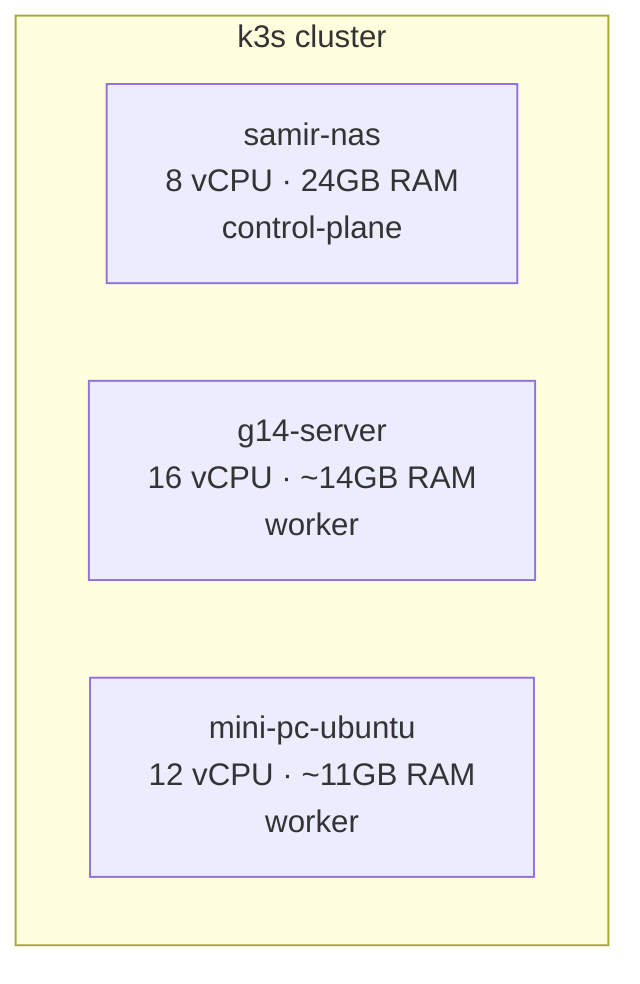

# Homelab to Production

A deliberate, self-directed path from a bare 3-node [k3s](https://k3s.io/) cluster to a production-shaped homelab — GitOps, observability, backup/disaster recovery, and the real debugging stories along the way.

This isn't a tutorial-clone. Each phase follows a [roadmap](./ROADMAP.md) I made with the help of some Youtube videos and Claude's research that names the tool(s) and the target shape, but not the exact manifest/Steps — the point is building real judgment about *why* a given tool or pattern fits, not copy-pasting one.

## The cluster

Three bare nodes, no cloud, no managed control plane:

`samir-nas` also runs an unrelated, pre-existing Plex/Sonarr/Radarr Docker Compose stack on the same physical box — outside this cluster, but a real constraint the exposure phase has to account for.

## Progress

| Phase | What | Status |
|---|---|---|
| 0 | [Manual deployment, by hand](./phases/phase-0-manual-deploy.md) — pgAdmin as Deployment + PVC + Service, no Helm, no generator | ✅ Done |
| 1 | [Cluster structure](./phases/phase-1-cluster-structure.md) — namespaces, mandatory resource limits, node labeling | ✅ Done |
| 2 | [Storage](./phases/phase-2-longhorn.md) — Longhorn replacing `local-path`, with a real node-kill test | ✅ Done |
| 3 | GitOps — Argo CD, app-of-apps, two repos | ⏳ Planned |
| 4 | Secrets — Sealed Secrets | ⏳ Planned |
| 5 | Exposure — Cloudflare Tunnel + Ingress | ⏳ Planned |
| 6 | Observability — kube-prometheus-stack | ⏳ Planned |
| 7 | Backup/DR — Velero, off-box target | ⏳ Planned |
| 8 | Practicing failure on purpose | ⏳ Planned |

## Incidents

Real problems hit and fixed along the way — not staged, not skipped over:

- [pgAdmin OOMKilled during Phase 0](./incidents/oom-killed-pgadmin.md)
